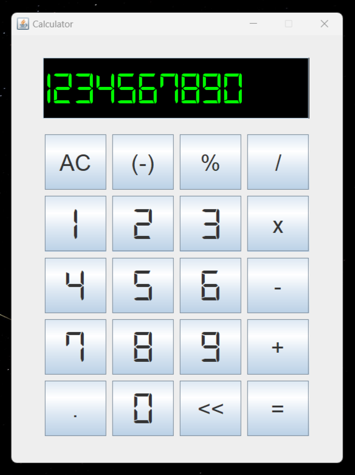
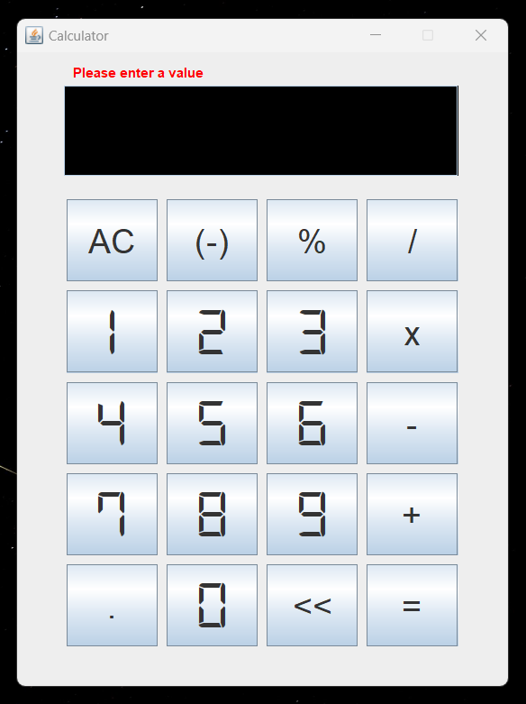
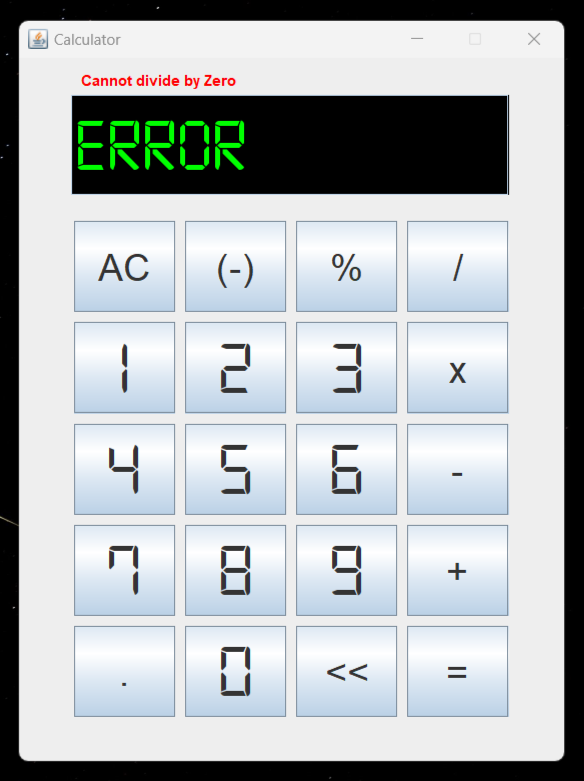

# Calculator
A calculator I built using **Java** in Apache NetBeans IDE 15.

## Features
* Takes float values
* Label to display messages
* Textfield to display operations
* Arithmetic Operations:
    * Addition (+)
    * Subtraction (-)
    * Multiplication (*)
    * Division (/)
    * Percentage (%)
* Other Operations:
    * Clear Button (Clr)
    * Backspace Button (<<)
    * Decimal Button (.)
    * Equals Button (=)
    * Negative Button ((-))

## Screenshots

